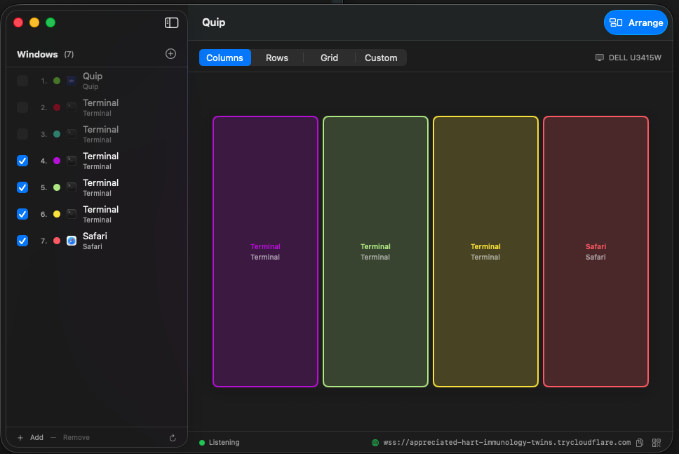
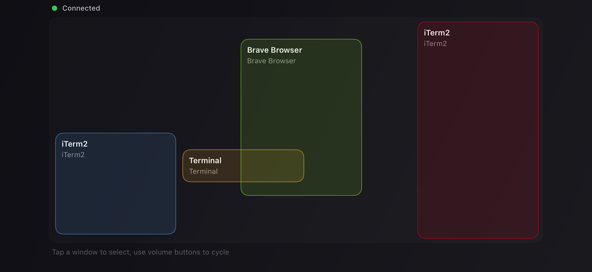

#  Quip

Talk to your Claude instances. All of them. From your couch. No keyboard needed.

Quip turns your phone into a voice remote for any number of [Claude Code](https://claude.ai/claude-code) sessions running on your Mac or Linux machine. Just speak your prompt and it lands in the right terminal.


### Desktop:


### Mobile (Standard Desktop View):


### Mobile (Arranged View):


## The idea

You're running 4 Claude sessions across different projects. You don't want to walk over to your keyboard every time you have a thought. You just want to say "refactor the auth middleware" and have it go to the right Claude.

That's Quip. Push-to-talk prompting from your phone.

- **Volume down** to start talking, **any volume button** to stop
- **Tap a window** on your phone to pick which Claude gets your prompt
- **See all your sessions** mirrored live on your phone's screen
- **Quick actions** — hit Return, Ctrl+C, restart Claude, clear context, all from context menus
- **View terminal output** — read the last 200 lines of any terminal from your phone
- **Arrange windows** on your Mac or Linux desktop with one tap
- **QR code sharing** — scan a QR code from the desktop app to connect instantly
- **Works with iPhone and Android**

## Connecting

Just open both apps. Quip finds your Mac/Linux machine automatically over the local network via Bonjour/mDNS.

For remote use, a Cloudflare tunnel is bundled — no install, no config, no account needed.

## Building

### macOS + iOS

Requires macOS 14+, iOS 17+, Xcode 16+, and [XcodeGen](https://github.com/yonaskolb/XcodeGen).

```bash
cd QuipMac && xcodegen generate && cd ..
cd QuipiOS && xcodegen generate && cd ..
```

**Install iPhone app over the air on your paired device (recommended):**

```bash
# Build
xcodebuild -project QuipiOS/QuipiOS.xcodeproj -scheme QuipiOS \
  -destination 'generic/platform=iOS' -derivedDataPath QuipiOS/build build

# Install wirelessly on Tim apple 17 (replace with your device name — list paired
# devices with `xcrun devicectl list devices`)
xcrun devicectl device install app --device "Tim apple 17" \
  QuipiOS/build/Build/Products/Debug-iphoneos/Quip.app
```

**Build Mac app:**

```bash
xcodebuild -project QuipMac/QuipMac.xcodeproj -scheme QuipMac build
```

**Alternative — iOS generic build without install (for CI or generic device targets):**

```bash
xcodebuild -project QuipiOS/QuipiOS.xcodeproj -scheme QuipiOS \
  -destination 'generic/platform=iOS' build
```

**Note:** `QuipMac/Info.plist` and `QuipiOS/Info.plist` are gitignored — they're regenerated from `project.yml` by `xcodegen generate`. Edit `project.yml`, not the `Info.plist`. (`.xcodeproj` files stay tracked so fresh clones open in Xcode without `xcodegen` first, but `Info.plist` is small enough to fall into "I'll just edit it directly" traps — hence the asymmetry.)

### Android

Requires Android SDK 34 and Java 17.

```bash
cd QuipAndroid && ./gradlew assembleDebug
adb install app/build/outputs/apk/debug/app-debug.apk
```

Or download the APK from the [latest release](https://github.com/jboert/Quip/releases).

### Linux

Requires Rust 1.75+, GTK4, and libadwaita. On openSUSE Tumbleweed:

```bash
sudo zypper install gtk4-devel libadwaita-devel gcc pkg-config
# For X11:
sudo zypper install xdotool wmctrl
# For Wayland (sway):
sudo zypper install ydotool wtype

cd QuipLinux && cargo build --release
```

The binary will be at `QuipLinux/target/release/quip-linux`.

**Supported display servers:**
- **X11** — full support (xdotool/wmctrl for window management)
- **Wayland (sway)** — full support via sway IPC
- **Wayland (Hyprland)** — window enumeration + arrangement
- **Wayland (KDE Plasma)** — full support via kdotool (install `kdotool`; uses ydotool/wtype for input)
- **Wayland (GNOME)** — full support via [Window Commander](https://extensions.gnome.org/extension/7302/window-commander/) extension (uses ydotool/wtype for input)

## How it works

Your phone records speech, transcribes it on-device, and sends the text over WebSocket to the Mac/Linux app. The app injects the text into whichever terminal window you selected.

The desktop app broadcasts your window layout to the phone in real-time, so you always see what's where.

```
  Phone                            Mac / Linux
  +---------------+                +------------------+
  | speak prompt  |   WebSocket    | inject into      |
  | pick window   | ============> | correct terminal |
  | see layout    | <============ | broadcast layout |
  +---------------+                +------------------+
```

## License

GPLv3 — see [LICENSE](LICENSE)
